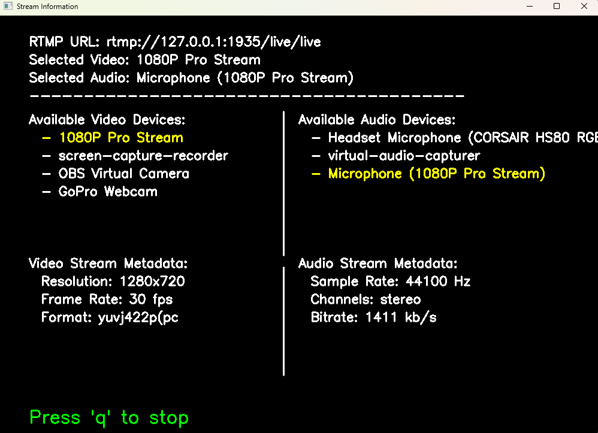

# 📡 RTMP Webcam Streaming & Server

This repository provides two functionalities within a single script:

- **Webcam Streaming** – Uses FFmpeg to stream a webcam feed with audio.
- **RTMP Server** – A minimal RTMP server that listens for incoming streams, performs the handshake, and optionally launches FFmpeg to engage a stream with the server; if false, manually launch OBS Studio to launch a stream.

## 🚀 Features
### ✅ Webcam Streaming
- Lists available video and audio devices upon launch.
- Highlights the configured devices in **yellow** if they match system devices.
- Streams video via **FFmpeg**.
- Responds to the `q` key to stop the stream.
- Displays **metadata** with video and audio stream information.
- 

### ✅ RTMP Server
- Listens for incoming RTMP streams on the configured **port**.
- Performs the **RTMP handshake**.
- Attempts to start the stream.
- Can automatically launch FFmpeg upon receiving a connection.

---

## 🛠 Configuration
Modify the **configuration settings** at the top of the script:
- Select the correct **video** and **audio** devices.
- Set the **RTMP URL** for streaming.
- Choose whether to **automatically launch FFmpeg** when receiving a connection.

---

## ▶️ Usage
1. Modify the configuration settings at the top of the 'main.py' script.
2. Run the script:
   ```sh
   python main.py

3. Modify the **configuration settings** at the top of `RTMPServer.py` to select the correct **video** and **audio** devices, and whether to launch FFMpeg automatically
4. Run the script:
   ```sh
   python RTMPServer.py
